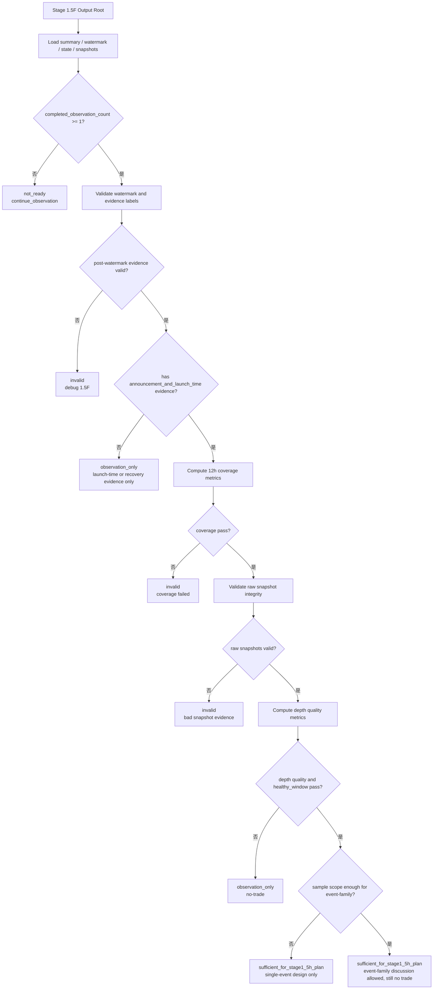

# External Signal Shadow Lab Stage 1.5G Live Depth Evidence Review Design

**日期:** 2026-07-06
**状态:** design_draft
**上游依赖:** Stage 1.5D title-contract/transient-detail collector + Stage 1.5F delayed-launch age gate observer
**当前执行边界:** 可先写 design / implementation plan；正式 review 必须等待至少一个 post-watermark event-symbol 完成 12h live depth observation。

---

## 1. 一句话结论

Stage 1.5G 不是新采集器，也不是交易策略。

它是 Stage 1.5F 的证据审查层：

```text
读取 1.5F 对 post-watermark futures launch event-symbol 录制的 12h depth snapshots，
检查盘口证据是否完整、可审计、足以支持继续研究 execution 条件。
```

Stage 1.5G 最多允许输出：

```text
depth_evidence_sufficient_for_next_research_step
```

它不允许输出：

```text
execution_feasibility_proven
alpha_confirmed
trade_signal
paper_ready
live_ready
execution_engine_allowed
```

一句话：

```text
1.5F 是盘口录像机；1.5G 是看片审查员；它只判断片子够不够清楚，不能直接判定交易能赚钱。
```

---

## 2. 为什么需要 Stage 1.5G

Stage 1.5C/1.5D 的 close-price replay 可以说明某些 futures launch 事件在收盘价层面有过异动，但它无法证明真实可成交性。

Stage 1.5E 已经指出关键缺口：

```text
historical_orderbook_depth_available = false
execution_feasibility_proven = false
```

也就是说：

```text
Kline 看起来有空间，不代表当时盘口真的能进出。
```

Stage 1.5F 负责在新事件发生后录制 12h public depth evidence。Stage 1.5G 负责审查这批证据是否能回答下面的问题：

```text
1. 1.5F 是否真的覆盖了事件后完整 12h？
2. 数据是否连续、无大段缺口、请求健康？
3. spread / depth / 500 USDT slippage proxy 是否在可继续研究范围？
4. event source delay、symbol extraction delay、watermark 是否会污染证据解释？
5. close-price replay 是否仍可能只是不可成交的纸面幻觉？
```

---

## 3. Scope / Non-Scope

### 3.1 Scope

Stage 1.5G 只做离线 review：

```text
input:
  - Stage 1.5F output root
  - live_depth_observer_summary.json
  - watermark.json
  - observer_state.jsonl
  - depth_snapshots/**/*.jsonl
  - events_accepted/**/*.jsonl
  - events_rejected/**/*.jsonl
  - heartbeat/**/*.jsonl
  - request_manifest/**/*.jsonl

output:
  - stage1_5g_live_depth_evidence_review_summary.json
  - docs/reviews/YYYY-MM-DD-external-signal-shadow-lab-stage1-5g-live-depth-evidence-review_CN.md
```

它审查：

```text
coverage quality
request health
depth quality
slippage proxy quality
watermark and evidence label integrity
event timing delays
whether next research stage is justified
```

### 3.2 Non-Scope

Stage 1.5G 不做：

```text
new live depth collection
order placement
paper trading
live trading
signal generation
position sizing
alpha conclusion
full execution simulator
maker/taker fill simulation
dual-leg execution simulation
```

如果 Stage 1.5G 通过，下一步只能是：

```text
Stage 1.5H shadow execution simulator design / plan
```

不能跳到 paper/live。

---

## 4. 输入文件与字段含义

### 4.1 `live_depth_observer_summary.json`

用途：

```text
给出 1.5F observer 的总体状态与安全开关。
```

核心字段：

| 字段 | 含义 | 1.5G 用法 |
|---|---|---|
| `decision` | 1.5F 当前总决策，例如 running、in_progress、depth_evidence_collected | 判断能否进入正式 review |
| `watermark_present` | 是否存在 watermark 文件 | 缺失则证据链不成立 |
| `post_watermark_events_accepted` | watermark 之后被接受的 event-symbol 数 | 必须大于 0 才可能有正式 evidence |
| `active_observation_count` | 仍在采集中的观察对象数 | 大于 0 时只能做中途诊断 |
| `completed_observation_count` | 已完成 12h 观察的对象数 | 至少 1 才能做正式 evidence review |
| `total_snapshots_collected` | 已采集快照总数 | 用于初步判断证据规模 |
| `request_success_rate` | public depth 请求成功率 | 判断网络/API 健康 |
| `research_result_valid` | 1.5F 自己对结果有效性的布尔判断 | 1.5G 不能盲信，需要复核 |

### 4.2 `watermark.json`

用途：

```text
定义“哪些事件是启动 observer 前已经见过的旧事件”。
```

Stage 1.5G 必须确认：

```text
1. accepted evidence 来自 post-watermark event-symbol。
2. bootstrap/pre-watermark rows 没有被错误标成正式 12h live depth evidence。
3. accepted/rejected diagnostics 中的 watermark_max_seen_detected_at_ms 与 watermark.json 一致。
```

### 4.3 `events_accepted/**/*.jsonl`

用途：

```text
记录 1.5F 正式接受并开始观察的 event-symbol。
```

关键字段：

| 字段 | 含义 |
|---|---|
| `event_symbol_id` | 一篇公告中的单个 symbol 观察对象 id |
| `symbol` | Binance USD-M raw symbol，例如 `DATAIPUSDT`、`ETHUSD1`、`BTCU` |
| `source_article_id` | 来源公告 id |
| `observation_age_base_ms` | age gate 使用的时间锚点 |
| `observation_age_basis` | age base 来源，例如 `detected_at_ms`、`symbol_onboard_times_ms` |
| `event_age_ms` | 接受时距离 age base 的时间 |
| `evidence_label` | 证据标签，例如 `announcement_and_launch_time` / `launch_time_only` / `recovery_validation_only` |

### 4.4 `observer_state.jsonl`

用途：

```text
记录每个 event-symbol 的 12h 观察进度和覆盖质量。
```

Stage 1.5G 重点看：

```text
status
depth_snapshot_count
first_snapshot_at_ms
last_snapshot_at_ms
max_gap_ms
coverage_ratio
coverage_ratio_pass
max_gap_pass
research_result_valid
```

### 4.5 `depth_snapshots/**/*.jsonl`

用途：

```text
保存实际 public orderbook 快照和派生盘口指标。
```

最小需要字段：

```text
event_symbol_id
symbol
fetched_at_ms
best_bid
best_ask
mid_price
spread_bps
top_bid_depth_usdt
top_ask_depth_usdt
buy_slippage_bps
sell_slippage_bps
```

如果这些字段缺失或大量为 null，1.5G 不得给通过结论。

---

## 5. Review 判定层级

Stage 1.5G 不使用单一 pass/fail。建议输出四档：

```text
stage1_5g_not_ready_no_completed_observation
stage1_5g_depth_evidence_invalid
stage1_5g_depth_evidence_observation_only
stage1_5g_depth_evidence_sufficient_for_stage1_5h_plan
```

含义：

| decision | 含义 | 下一步 |
|---|---|---|
| `stage1_5g_not_ready_no_completed_observation` | 还没有完成 12h 的 event-symbol | 继续等待 1.5F |
| `stage1_5g_depth_evidence_invalid` | 数据缺失、watermark 错位、coverage 失败或请求失败严重 | 回到 1.5D/1.5F 排障 |
| `stage1_5g_depth_evidence_observation_only` | 证据可审计，但盘口质量或样本不足，不支持继续执行研究 | 保留 no-trade，继续积累 |
| `stage1_5g_depth_evidence_sufficient_for_stage1_5h_plan` | 证据完整且盘口指标未明显否决后续研究 | 只允许写 1.5H shadow execution simulator design/plan |

所有 decision 都必须保持：

```text
trade_signal_allowed = false
paper_trading_allowed = false
live_trading_allowed = false
execution_engine_allowed = false
alpha_interpretation_allowed = false
```

---

## 6. 配置常量要求

Stage 1.5G 的所有阈值必须集中在 `configs/base.py`，implementation 不得在脚本中硬编码 magic numbers。

原因：

```text
1. 1.5G 是 evidence review 层，阈值直接影响是否允许继续后续研究。
2. 阈值散落在脚本中会导致 review 结果不可复核。
3. 项目规则要求所有 thresholds 都来自 configs/base.py。
```

建议新增配置区：

```python
# Stage 1.5G live depth evidence review. Observation-only thresholds.
EXTERNAL_SIGNAL_STAGE1_5G_SCHEMA_VERSION = 1
EXTERNAL_SIGNAL_STAGE1_5G_MIN_REQUEST_SUCCESS_RATE = 0.98
EXTERNAL_SIGNAL_STAGE1_5G_MIN_PER_SYMBOL_REQUEST_SUCCESS_RATE = 0.98
EXTERNAL_SIGNAL_STAGE1_5G_MIN_SNAPSHOT_COVERAGE_RATIO = 0.95
EXTERNAL_SIGNAL_STAGE1_5G_MAX_SNAPSHOT_GAP_MULTIPLIER = 5
EXTERNAL_SIGNAL_STAGE1_5G_MAX_SNAPSHOT_GAP_FLOOR_MS = 10 * 60 * 1000
EXTERNAL_SIGNAL_STAGE1_5G_SLIPPAGE_TEST_NOTIONAL_USDT = 500.0
EXTERNAL_SIGNAL_STAGE1_5G_MAX_SPREAD_BPS_P50 = 30.0
EXTERNAL_SIGNAL_STAGE1_5G_MAX_SPREAD_BPS_P95 = 100.0
EXTERNAL_SIGNAL_STAGE1_5G_MAX_BUY_SLIPPAGE_BPS_P50 = 50.0
EXTERNAL_SIGNAL_STAGE1_5G_MAX_SELL_SLIPPAGE_BPS_P50 = 50.0
EXTERNAL_SIGNAL_STAGE1_5G_MAX_BUY_SLIPPAGE_BPS_P95 = 150.0
EXTERNAL_SIGNAL_STAGE1_5G_MAX_SELL_SLIPPAGE_BPS_P95 = 150.0
EXTERNAL_SIGNAL_STAGE1_5G_MIN_TOP_BID_DEPTH_USDT_P50 = 500.0
EXTERNAL_SIGNAL_STAGE1_5G_MIN_TOP_ASK_DEPTH_USDT_P50 = 500.0
EXTERNAL_SIGNAL_STAGE1_5G_MIN_TOP_BID_DEPTH_USDT_P05 = 250.0
EXTERNAL_SIGNAL_STAGE1_5G_MIN_TOP_ASK_DEPTH_USDT_P05 = 250.0
EXTERNAL_SIGNAL_STAGE1_5G_MIN_HEALTHY_WINDOW_RATIO = 0.90
EXTERNAL_SIGNAL_STAGE1_5G_MAX_NULL_RATIO = 0.01
EXTERNAL_SIGNAL_STAGE1_5G_MAX_DUPLICATE_SNAPSHOT_RATIO = 0.05
EXTERNAL_SIGNAL_STAGE1_5G_MIN_EVENT_FAMILY_SAMPLE_REQUIRED = 3
EXTERNAL_SIGNAL_STAGE1_5G_MIN_SOURCE_ARTICLES_REQUIRED = 2
```

其中 `RISK_MAX_SINGLE_POSITION_USDT` 已存在于 `configs/base.py`。1.5G 应记录：

```text
depth_capacity_ratio_to_risk_cap = top_depth_usdt / RISK_MAX_SINGLE_POSITION_USDT
```

这个 ratio 只用于解释盘口容量，不等价于可下单容量。

---

## 7. 通过门槛

### 7.1 证据完整性门槛

必须全部满足：

```text
completed_observation_count >= 1
post_watermark_events_accepted >= 1
watermark_present = true
watermark_version = 1
depth_snapshot_count >= computed_min_snapshot_count_required
coverage_ratio >= EXTERNAL_SIGNAL_STAGE1_5G_MIN_SNAPSHOT_COVERAGE_RATIO
max_gap_ms <= computed_max_gap_ms
request_success_rate >= EXTERNAL_SIGNAL_STAGE1_5G_MIN_REQUEST_SUCCESS_RATE
per_symbol_request_success_rate >= EXTERNAL_SIGNAL_STAGE1_5G_MIN_PER_SYMBOL_REQUEST_SUCCESS_RATE
failed_observation_count = 0 for reviewed event-symbols
```

coverage 必须由 1.5G 自己按 1.5F 采样配置复算：

```text
snapshot_interval_ms = EXTERNAL_SIGNAL_STAGE1_5F_DEPTH_POLL_INTERVAL_SEC * 1000
expected_snapshot_count = EXTERNAL_SIGNAL_STAGE1_5F_OBSERVATION_WINDOW_MS / snapshot_interval_ms
computed_min_snapshot_count_required = floor(expected_snapshot_count * EXTERNAL_SIGNAL_STAGE1_5G_MIN_SNAPSHOT_COVERAGE_RATIO)
computed_max_gap_ms = max(
  EXTERNAL_SIGNAL_STAGE1_5G_MAX_SNAPSHOT_GAP_MULTIPLIER * snapshot_interval_ms,
  EXTERNAL_SIGNAL_STAGE1_5G_MAX_SNAPSHOT_GAP_FLOOR_MS
)
```

全局 request success 不能替代 per-symbol health。一个 symbol 的请求坏掉时，即使总成功率被其他 symbol 稀释，也必须把该 event-symbol 降级或判 invalid。

如果缺少完整 12h observation：

```text
decision = stage1_5g_not_ready_no_completed_observation
```

### 7.2 盘口质量门槛

第一版不把盘口质量写成交易阈值，只写成继续研究阈值。建议默认：

```text
spread_bps_p50 <= EXTERNAL_SIGNAL_STAGE1_5G_MAX_SPREAD_BPS_P50
spread_bps_p95 <= EXTERNAL_SIGNAL_STAGE1_5G_MAX_SPREAD_BPS_P95
buy_slippage_bps_500usdt_p50 <= EXTERNAL_SIGNAL_STAGE1_5G_MAX_BUY_SLIPPAGE_BPS_P50
sell_slippage_bps_500usdt_p50 <= EXTERNAL_SIGNAL_STAGE1_5G_MAX_SELL_SLIPPAGE_BPS_P50
buy_slippage_bps_500usdt_p95 <= EXTERNAL_SIGNAL_STAGE1_5G_MAX_BUY_SLIPPAGE_BPS_P95
sell_slippage_bps_500usdt_p95 <= EXTERNAL_SIGNAL_STAGE1_5G_MAX_SELL_SLIPPAGE_BPS_P95
top_bid_depth_usdt_p50 >= EXTERNAL_SIGNAL_STAGE1_5G_MIN_TOP_BID_DEPTH_USDT_P50
top_ask_depth_usdt_p50 >= EXTERNAL_SIGNAL_STAGE1_5G_MIN_TOP_ASK_DEPTH_USDT_P50
top_bid_depth_usdt_p05 >= EXTERNAL_SIGNAL_STAGE1_5G_MIN_TOP_BID_DEPTH_USDT_P05
top_ask_depth_usdt_p05 >= EXTERNAL_SIGNAL_STAGE1_5G_MIN_TOP_ASK_DEPTH_USDT_P05
healthy_window_ratio >= EXTERNAL_SIGNAL_STAGE1_5G_MIN_HEALTHY_WINDOW_RATIO
```

解释：

```text
这些不是实盘可交易阈值，只是“是否值得继续做 shadow execution simulator”的最低证据门槛。
真正的下单规模、maker/taker、partial fill、单腿暴露、撤单失败，必须留给 1.5H。
500 USDT slippage proxy 只是固定名义金额的静态代理，不得写成 execution capacity。
```

如果盘口质量未达标但数据可审计：

```text
decision = stage1_5g_depth_evidence_observation_only
```

### 7.3 时间与 evidence label 门槛

Stage 1.5G 必须区分三类证据：

```text
announcement_and_launch_time:
  公告捕获时间与合约 launch/onboard 时间都在 watermark 之后。
  这是最完整的 live evidence。

launch_time_only:
  公告捕获在 watermark 前或旧事件中，但 launch/onboard 在 watermark 后。
  可以审查 launch-time orderbook，但不能证明 announcement edge。

recovery_validation_only:
  旧 root、旧 terminal_failed、旧 watermark 跨过的事件，或专门用于验证 parser/retry/loader 修复的恢复性输出。
  可以用于验证修复是否生效。
  不得计入 formal 12h live depth evidence。
  不得触发 sufficient_for_stage1_5h_plan。
```

`launch_time_only` 不能触发通用 1.5H：

```text
if evidence_labels["announcement_and_launch_time"] >= 1:
  allowed_next_action may be write_stage1_5h_shadow_execution_simulator_design

if only launch_time_only evidence exists:
  decision = stage1_5g_depth_evidence_observation_only
  allowed_next_action = continue_observation

if only recovery_validation_only evidence exists:
  decision = stage1_5g_depth_evidence_observation_only
  allowed_next_action = debug_stage1_5d_or_1_5f
```

如果 evidence label 缺失：

```text
decision = stage1_5g_depth_evidence_invalid
```

### 7.4 样本范围门槛

单个 12h completed event-symbol 只能支持“写 1.5H design/plan”，不能支持 event-family 级结论。

summary 必须写出：

```json
{
  "evidence_scope": "single_event",
  "event_family_conclusion_allowed": false,
  "min_event_family_sample_required": 3,
  "min_source_articles_required": 2
}
```

规则：

```text
1 completed event-symbol:
  只允许写 1.5H design/plan，不允许声明路线可行。

>= 3 completed event-symbols and >= 2 source_article_id:
  才允许在 review 中讨论 event-family 级别的后续研究价值。

任何样本规模:
  仍然不允许 alpha / paper / live / execution_engine。
```

### 7.5 Raw Snapshot Integrity Gate

1.5G 必须先检查 raw snapshot 是否自洽，再计算分位数。

以下情况必须判 invalid 或降级 observation-only：

```text
best_bid <= 0
best_ask <= 0
best_bid >= best_ask
mid_price <= 0
spread_bps < 0
fetched_at_ms 非单调
重复 snapshot 占比 > EXTERNAL_SIGNAL_STAGE1_5G_MAX_DUPLICATE_SNAPSHOT_RATIO
symbol 与 event_symbol_id 映射不一致
关键字段 null_ratio > EXTERNAL_SIGNAL_STAGE1_5G_MAX_NULL_RATIO
depth / slippage 字段出现非数值、负数或无穷值
```

如果 raw integrity 不通过：

```text
decision = stage1_5g_depth_evidence_invalid
```

---

## 8. Review 输出 Summary Schema

建议输出 JSON：

```json
{
  "schema_version": 1,
  "decision": "stage1_5g_depth_evidence_observation_only",
  "review_generated_at_ms": 0,
  "config_version": "configs/base.py:EXTERNAL_SIGNAL_STAGE1_5G_*",
  "stage1_5f_output_root": "",
  "watermark_max_seen_detected_at_ms": 0,
  "reviewed_event_symbol_count": 0,
  "completed_event_symbol_count": 0,
  "valid_evidence_event_symbol_count": 0,
  "invalid_evidence_event_symbol_count": 0,
  "evidence_scope": "single_event",
  "event_family_conclusion_allowed": false,
  "min_event_family_sample_required": 3,
  "min_source_articles_required": 2,
  "evidence_labels": {
    "announcement_and_launch_time": 0,
    "launch_time_only": 0,
    "recovery_validation_only": 0
  },
  "coverage": {
    "min_snapshot_count_required": 0,
    "expected_snapshot_count": 0,
    "snapshot_interval_ms": 0,
    "snapshot_count_min": 0,
    "snapshot_count_p50": 0,
    "snapshot_count_max": 0,
    "max_gap_ms_max": 0,
    "coverage_ratio_min": 0.0
  },
  "request_health": {
    "request_success_rate": 0.0,
    "per_symbol_request_success_rate_min": 0.0,
    "failed_requests_count": 0,
    "max_consecutive_network_errors_seen": 0
  },
  "depth_quality": {
    "spread_bps_p50": null,
    "spread_bps_p95": null,
    "buy_slippage_bps_500usdt_p50": null,
    "buy_slippage_bps_500usdt_p95": null,
    "sell_slippage_bps_500usdt_p50": null,
    "sell_slippage_bps_500usdt_p95": null,
    "top_bid_depth_usdt_p50": null,
    "top_bid_depth_usdt_p05": null,
    "top_ask_depth_usdt_p50": null,
    "top_ask_depth_usdt_p05": null,
    "healthy_window_ratio": null,
    "depth_capacity_ratio_to_risk_cap_p50": null
  },
  "raw_snapshot_integrity": {
    "null_ratio_max": 0.0,
    "duplicate_snapshot_ratio_max": 0.0,
    "non_monotonic_timestamp_count": 0,
    "invalid_book_count": 0
  },
  "safety": {
    "execution_feasibility_claim_allowed": false,
    "trade_signal_allowed": false,
    "paper_trading_allowed": false,
    "live_trading_allowed": false,
    "execution_engine_allowed": false,
    "alpha_interpretation_allowed": false
  },
  "reviewed_event_symbols": [],
  "event_level_decisions": [],
  "blockers": [],
  "warnings": [],
  "allowed_next_action": "continue_observation"
}
```

`allowed_next_action` 只允许：

```text
continue_observation
debug_stage1_5d_or_1_5f
write_stage1_5h_shadow_execution_simulator_design
stop_this_event_family_observation_only
```

---

## 9. 中文 Review 文档结构

Stage 1.5G 生成的 review markdown 建议包含：

```text
1. Decision / 当前结论
2. Safety Boundaries
3. 输入路径与 watermark 审计
4. Reviewed Event-Symbols
5. 12h Coverage Review
6. Request Health Review
7. Raw Snapshot Integrity Review
8. Depth Quality Review
9. Evidence Label Review
10. Event-Family Scope Review
11. 为什么仍不能 paper/live
12. 下一步行动
```

每个 event-symbol 需要一张小表：

| 字段 | 说明 |
|---|---|
| `symbol` | 被观察合约 |
| `source_article_id` | 来源公告 |
| `evidence_label` | announcement/launch 证据类型 |
| `observation_start_utc` | 观察开始时间 |
| `observation_end_utc` | 观察结束时间 |
| `snapshot_count` | 快照数 |
| `max_gap_minutes` | 最大缺口 |
| `per_symbol_request_success_rate` | 该 symbol 自身请求成功率 |
| `spread_bps_p50/p95` | 买卖价差中位数和尾部 |
| `buy/sell_slippage_bps_p50/p95` | 500 USDT 静态滑点代理中位数和尾部 |
| `top_bid/top_ask_depth_usdt_p05/p50` | 顶层盘口深度的低分位和中位数 |
| `healthy_window_ratio` | 12h 内盘口质量同时满足阈值的窗口占比 |
| `depth_capacity_ratio_to_risk_cap_p50` | 顶层深度相对 `RISK_MAX_SINGLE_POSITION_USDT` 的中位容量比例 |
| `raw_snapshot_integrity_status` | raw snapshot 自洽性状态 |
| `review_status` | valid / invalid / observation_only |

---

## 10. Failure Handling

### 10.1 没有完成观察

```text
condition:
  completed_observation_count = 0

decision:
  stage1_5g_not_ready_no_completed_observation

allowed_next_action:
  continue_observation
```

### 10.2 watermark 或 evidence label 不一致

```text
condition:
  accepted row missing watermark diagnostics
  evidence label missing
  pre-watermark row treated as formal evidence

decision:
  stage1_5g_depth_evidence_invalid

allowed_next_action:
  debug_stage1_5d_or_1_5f
```

### 10.3 coverage 不足

```text
condition:
  snapshot_count < computed_min_snapshot_count_required
  max_gap_ms > computed_max_gap_ms
  coverage_ratio < EXTERNAL_SIGNAL_STAGE1_5G_MIN_SNAPSHOT_COVERAGE_RATIO
  per_symbol_request_success_rate < EXTERNAL_SIGNAL_STAGE1_5G_MIN_PER_SYMBOL_REQUEST_SUCCESS_RATE

decision:
  stage1_5g_depth_evidence_invalid
```

### 10.4 raw snapshot 不自洽

```text
condition:
  best_bid <= 0
  best_ask <= 0
  best_bid >= best_ask
  fetched_at_ms 非单调
  null_ratio / duplicate_ratio 超过配置阈值
  symbol 与 event_symbol_id 映射冲突

decision:
  stage1_5g_depth_evidence_invalid

allowed_next_action:
  debug_stage1_5d_or_1_5f
```

### 10.5 盘口太薄或滑点太高

```text
condition:
  data is complete and auditable
  but spread/depth/slippage/healthy_window_ratio fails first-pass thresholds

decision:
  stage1_5g_depth_evidence_observation_only

allowed_next_action:
  stop_this_event_family_observation_only
```

### 10.6 只有 launch-time 或 recovery evidence

```text
condition:
  evidence_labels["announcement_and_launch_time"] = 0
  evidence_labels["launch_time_only"] > 0
  or evidence_labels["recovery_validation_only"] > 0

decision:
  stage1_5g_depth_evidence_observation_only

allowed_next_action:
  continue_observation
```

---

## 11. Implementation Plan 提示

后续 implementation plan 应拆成这些任务：

```text
Task 1: loader
  读取 1.5F output root 下 summary/watermark/state/snapshots/accepted/rejected/manifest。

Task 2: evidence integrity validator
  校验 watermark、post-watermark、evidence_label、accepted/rejected 一致性，并识别 recovery_validation_only。

Task 3: coverage metrics
  从 1.5F observation window / poll interval / 1.5G coverage ratio 复算 expected_snapshot_count、min_snapshot_count_required、max_gap，并计算 per-symbol health。

Task 4: raw snapshot integrity validator
  校验 bid/ask/mid/spread/timestamp/symbol/event_symbol_id/null_ratio/duplicate_ratio。

Task 5: depth quality metrics
  计算 spread、top depth、500 USDT buy/sell slippage proxy 的 p05/p50/p95、healthy_window_ratio、depth_capacity_ratio_to_risk_cap。

Task 6: event-scope and decision engine
  按 announcement_and_launch_time / launch_time_only / recovery_validation_only、样本数量、source_article 数量输出四档 decision 与 allowed_next_action。

Task 7: report writer
  写 JSON summary 与中文 review markdown。

Task 8: config tests
  确认 EXTERNAL_SIGNAL_STAGE1_5G_* 阈值都来自 configs/base.py，且 RISK_LIVE_TRADING_ENABLED 仍为 False。

Task 9: behavior tests
  覆盖 no completed observation、valid announcement_and_launch_time evidence、launch_time_only observation-only、recovery_validation_only excluded、coverage failure、per-symbol request failure、watermark mismatch、raw snapshot invalid、thin book observation-only。
```

Implementation plan 需要坚持 TDD：

```text
先写 fixtures 和失败测试，再写 loader / validator / reporter。
```

---

## 12. 流程图



---

## 13. Final Boundary

Stage 1.5G 可以回答：

```text
这批 12h live depth evidence 是否完整？
这批盘口证据是否足够支持继续做 shadow execution simulator？
close-price replay 是否仍存在明显盘口幻觉风险？
```

Stage 1.5G 不能回答：

```text
这条路线能不能赚钱？
是否可以 paper trading？
是否可以 live trading？
应该买还是卖？
应该下多大仓位？
```

如果 Stage 1.5G 最终通过，下一步仍然是：

```text
Stage 1.5H shadow execution simulator design / implementation plan
```

不是交易。
