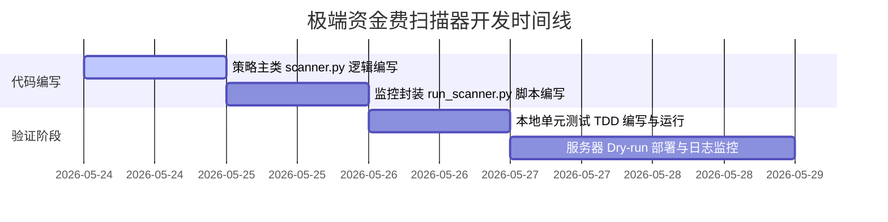

# 实施计划：极端资金费扫描器与监控模块 (Extreme Funding Scanner & Monitor)

## 1. 目标与背景

由于最近 74 天的数据分析显示交易所的实时公共接口在行情清淡时返回默认钳制值（±10.95% 年化），我们无法仅靠等待交易所的静态费率来捕捉极端信号。
本实施计划旨在实现 `src/strategies/extreme_funding/scanner.py`，它不仅符合新系统的统一策略接口协议，而且能够**监控衍生指标（如溢价指数 Premium Index、未平仓量 Open Interest 和 30天历史波动率 Volatility Baseline）**，提供更敏感的资金费爆发先导指标。

同时，我们将在 `scripts/run_scanner.py` 中实现一个轻量级的长期监控脚本，用于在服务器上不间断运行，实时计算指标并输出状态。

---

## 2. 核心架构与类设计

### 2.1 `ExtremeFundingStrategy` 策略类
文件：`src/strategies/extreme_funding/scanner.py`
继承：`src.strategies.base.BaseStrategy`

```python
from src.strategies.base import BaseStrategy, SignalCandidate

class ExtremeFundingStrategy(BaseStrategy):
    strategy_type = "extreme_funding"
    
    def __init__(self, config: dict):
        self.config = config
        # 内存缓冲，保存每个币种最近的 N 次观测值，用于计算 Persistence
        self.history_buffer = {}  # dict[str, list[float]]
        
    async def scan(self, market_data: dict[str, Any]) -> list[SignalCandidate]:
        """
        输入格式 market_data = {
            "symbol": "BTC/USDT",
            "premium_index": float,      # 实时溢价指数 (P)
            "estimated_funding": float,   # 交易所实时预测费率
            "open_interest": float,       # 实时未平仓合约量 (以基础币计)
            "oi_change_1h": float,        # 1小时OI变化率
            "volatility_30d_1h": float,   # 30天以1小时为窗口的历史波动率基准
        }
        """
        pass

    def should_exit(self, signal: SignalCandidate, current_market: dict[str, Any], position_age_hours: float, unrealized_pnl_pct: float) -> tuple[bool, str]:
        """
        出场逻辑：
        1. 资金费年化跌破 15% (或基差翻负)
        2. 达到最大持有时间 24h
        3. 累计基差亏损 > 累计收取租金的 50%
        """
        pass

    def risk_check(self, signal: SignalCandidate) -> tuple[bool, str]:
        """
        风控检查：
        1. 检查是否开启实盘 (base.py 中的 RISK_LIVE_TRADING_ENABLED)
        2. 单笔仓位上限检查
        3. 并发仓位上限检查
        """
        pass
```

### 2.2 监控循环脚本
文件：`scripts/run_scanner.py`
用途：代替老系统沉重的数据收集器，作为守护进程低频（如 10s 一次）运行：
1. 从 Binance 公共 API 获取所有目标币种（`BTC/USDT` 等）的最新指数、未平仓合约和历史 K 线。
2. 计算 30 天以 1 小时为窗口的波动率基准。
3. 调用 `ExtremeFundingStrategy.scan()` 得到信号。
4. **日志与警报输出**：
   - 每 5 分钟打印一次心跳日志（包含所有目标币种当前的费率、OI、溢价及波动率情况）。
   - 一旦触发信号，输出 `ALERT` 或 `SUCCESS` 级别日志，并可以配置通知接口（如 Telegram Bot 报警）。
   - 数据完全在内存中维护和更新，不向硬盘写入任何高频原始文件，极低消耗。

---

## 3. 衍生指标的计算与逻辑

### 3.1 溢价指数（Premium Index）反算预期资金费
为了绕过交易所的预测费率滞后和限幅：
*   **Binance 资金费计算公式**：
    $$\text{Funding Rate} = \text{Clamp}(\text{Premium Index} + \text{Clamp}(0.01\% - \text{Premium Index}, -0.05\%, 0.05\%), \text{Max}, \text{Min})$$
*   当多头情绪极度高涨，溢价指数超过 $0.05\%$ 时，真实的结算费率会不受钳制，直接开始反映溢价。
*   我们的扫描器将监控溢价指数的实时平均值。若溢价指数年化超过 $30\%$，即使交易所预测费率尚未更新，也立刻触发信号生成。

### 3.2 历史波动率基准计算（30-Day Volatility Baseline）
*   在 `run_scanner.py` 启动时，调用 `GET /fapi/v1/klines` 获取目标币种最近 720 个 1h K线数据（即 30 天）。
*   计算 1 小时收盘价对数收益率的标准差，作为该币种的**基准波动率**。
*   此后，每小时通过滑动窗口增量更新该波动率基准，无需反复拉取历史 K 线。

### 3.3 未平仓合约（Open Interest）变化率
*   每分钟拉取一次 `GET /fapi/v1/openInterest`，保留最近 60 个观测值计算 1h 变化率：
    $$\text{OI Change 1h} = \frac{\text{Current OI} - \text{OI 1h ago}}{\text{OI 1h ago}}$$

---

## 4. 实施步骤



1.  **Step 1**: 创建 `src/strategies/extreme_funding/scanner.py`，实现 `ExtremeFundingStrategy` 接口与滑动窗口 `Persistence` 计算逻辑。
2.  **Step 2**: 创建 `scripts/run_scanner.py`，实现多币种的 Binance REST API 轮询、1h K线基准计算与内存滑动更新。
3.  **Step 3**: 编写单元测试 `tests/strategies/test_extreme_funding.py`，用 Mock 数据验证扫描器在三种场景下的输出：
    - 场景 A：无波动、无溢价（默认费率 $\pm10.95\%$） $\rightarrow$ 返回无信号。
    - 场景 B：溢价暴涨但持续时间不够（Persistence < 0.7） $\rightarrow$ 返回无信号。
    - 场景 C：溢价暴涨且持续 15 次以上结算周期 $\rightarrow$ 正确输出 `SignalCandidate` 信号。
4.  **Step 4**: 启动 `run_scanner.py` 进行服务器干跑（Dry-run），验证日志输出和心跳报警。

---

## 5. 验收标准

1.  **单元测试验收**：运行 `PYTHONPATH=src pytest tests/strategies/` 100% 通过。
2.  **日志心跳验收**：`run_scanner.py` 连续运行 2 小时无内存泄露，并能每 5 分钟在控制台以格式化表格形式输出所有币种的实时监控指标（Price, Premium, OI, 1h OI Change, Vol, Est Funding）。
3.  **零磁盘碎裂**：扫描器运行期间没有任何临时文件或数据日志写入硬盘。
