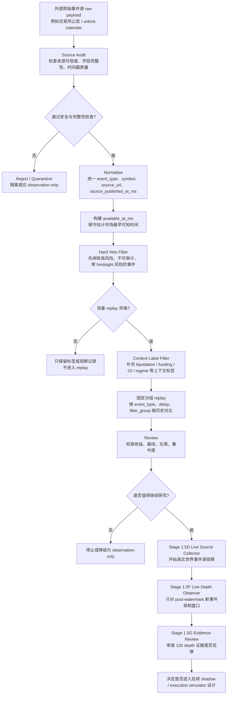

# External Signal Shadow Lab 分支说明：External Catalyst Events + Filter

日期：2026-06-21

## 1. 一句话结论

`External Catalyst Events + Filter` 是 External Signal Shadow Lab 在 Stage 1.4 之后的新分支。

它不是一个交易策略，也不是公告追涨系统。

它的目标是：

```text
把外部催化事件转换成可审计、可回放、可证伪的研究事件，
再用分层 filter matrix 判断哪些事件类型、哪些状态上下文可能具备进一步研究价值。
```

最终目标仍然是发现 alpha 候选，但本分支当前阶段不允许输出 alpha pass，也不允许 paper/live。

---

## 2. 为什么需要这个分支

前置研究已经连续证伪了多条低维或内生状态变量方向：

```text
Gate ticker / Binance proxy OHLCV 派生方向：失败。
Funding / OI / price crowding-only：失败。
OI drop + price flush deleveraging proxy：失败。
Local forceOrder snapshot：值得继续积累，但不是完整 liquidation tape，不能支持 full composite / alpha 结论。
```

这些结果共同说明：

```text
继续只在 CEX 内生状态变量中调阈值，边际价值下降。
```

因此下一步必须从：

```text
market state predicts market state
```

转向：

```text
external catalyst triggers market state transition
```

也就是：

```text
外生事件 -> 标准化 -> 安全审计 -> filter matrix -> 历史 replay -> review -> 决定继续或停止
```

---

## 3. external catalyst events 是什么

External catalyst events 指来自市场价格以外的外部事件。

第一版关注：

```text
交易所公告
合约 / 杠杆功能开通
交易对增加或移除
下线公告
重大解锁或释放计划
交易所状态变化
```

它们与前面 `cex_market_snapshot`、funding、OI、price、liquidation snapshot 的区别是：

```text
前者是外生催化事件；
后者是市场内部状态变量。
```

前面的 CEX 内生变量回答：

```text
市场已经发生了什么？
```

External catalyst events 要回答：

```text
是否有一个外部事件可能引发未来的仓位重估、流动性迁移或强制出清？
```

---

## 4. 它和 External Signal Shadow Lab 的关系

这是同一个 Lab 的新数据源分支，不是新项目。

External Signal Shadow Lab 的核心方法不变：

```text
raw payload
-> connector normalize
-> forbidden payload check
-> available_at_ms
-> risk / safety guard
-> replay
-> review
-> continue / stop
```

区别只在于输入源升级：

```text
Stage 1.2 输入：Gate public ticker snapshot
Stage 1.3 输入：OHLCV / ticker 派生事件
Stage 1.4 输入：funding / OI / price / forceOrder snapshot
Stage 1.5 输入：external catalyst events
```

### 4.1 `replay` 这个词在这里是什么意思

在程序开发里，`replay` 一般表示：

```text
把一段已经发生过的历史输入重新喂给系统，
按今天定义好的规则重新跑一遍，
看看系统会给出什么结果。
```

在本分支里，`replay` 不是动画回放，也不是模拟下单，而是：

```text
把历史 external catalyst event 按统一的 available_at_ms、entry delay、cost、baseline、filter group 重新计算，
检查这类事件过去是否真的比随机基线或普通价格基线更有信息量。
```

一句话理解：

```text
replay = 历史事件的离线体检
```

它回答的是“这类事件过去值不值得继续研究”，而不是“今天能不能立刻交易”。

### 4.2 全流程图：每一步的作用和目的



各步骤的作用：

```text
raw payload:
  保存原始证据，避免后面出现“我不知道原文是什么”的审计断层。

source audit:
  判断来源是否可信、是否有足够历史、字段是否稳定。

normalize:
  把不同来源、不同语言、不同页面结构压成统一事件表。

available_at_ms:
  保守估计“市场最早可能知道这个事件”的时间，防止 hindsight bias。

hard veto filter:
  先做硬性排雷，不让危险或不可审计事件进入后续统计。

context label filter:
  给事件补充“发生时市场处于什么状态”的说明，帮助分组对比，但不直接当交易信号。

replay:
  做历史证伪，检查某类事件是否真的比随机基线更有信息量。

live source collector:
  进入真实世界观测，检查公告延迟、字段稳定性、symbols 解析是否可靠。

live depth observer:
  记录真实盘口，而不是继续用 close-price proxy 假装可成交。

evidence review:
  判断“是否值得继续研究执行条件”，而不是直接证明 alpha 或允许交易。
```

---

## 5. 这个分支不是什么

它不是：

```text
公告追涨系统
新币 listing 抢跑系统
whale deposit 开空系统
链上 smart money 自动跟单系统
KOL/news 秒级抢跑系统
liquidation 接飞刀实盘系统
```

它也不允许：

```text
api_key
secret
private_key
wallet_seed
mnemonic
signed_tx
raw_tx
order_request
swap_request
transfer_request
wallet_private_key
tx_payload
```

任何外部 payload 出现上述字段，必须 reject。

---

## 6. 核心研究假设

本分支的核心假设不是：

```text
外部公告一出就上涨或下跌。
```

而是：

```text
某些外部事件会改变市场参与者的预期、杠杆可得性、供给压力或流动性结构；
这些变化可能在事件后 1h / 4h / 12h / 24h 内形成可观测的状态切换；
合适的 filter matrix 可能帮助区分噪音事件和高信息密度事件。
```

简化为：

```text
external catalyst = 压力源
filter matrix = 风险与状态识别器
replay = 证伪器
```

---

## 7. 为什么不能直接收集所有 events

因为没有 schema 和 filter 之前，收集 events 会带来四类污染：

```text
1. event_type 语义污染：listing / delisting / unlock / futures launch 被混成一个 signal。
2. available_at_ms 污染：历史发布时间被误当成真实可得时间。
3. hindsight bias：今天看到的过去 event calendar 未必是当时市场知道的信息。
4. filter 误用：已经失败的 OI/price proxy 被偷偷塞回硬过滤器。
```

因此必须先写 Stage 1.5 filter matrix design，再做 source audit。

---

## 8. 推荐事件源

### 8.1 第一优先：官方交易所公告

适合研究：

```text
delisting_notice
futures_contract_launch
margin_enablement
trading_pair_addition
trading_pair_removal
exchange_status_event
```

优势：

```text
source 可信
事件语义较硬
适合 historical replay
```

风险：

```text
结构化差
分页 / 反爬 / 多语言页面可能造成字段不稳定
available_at_ms 需要保守估计
```

### 8.2 第二优先：Token unlock calendars

适合研究：

```text
major_unlock_event
large_scheduled_token_emission
```

优势：

```text
事件强度字段较清晰
可计算 unlock amount / float percentage / volume ratio
```

风险：

```text
历史 schedule 存在 hindsight risk
很多 token 不符合资产质量门槛
不适合第一版直接 directional replay
```

### 8.3 第三优先：Crypto event calendars

适合：

```text
source discovery
observation-only
辅助补充
```

不适合第一版主线，因为噪音高、事件类型泛化、历史数据可能受限。

---

## 9. Filter 的角色

Filter 不是一个神奇入场条件。

Filter 分为四类：

```text
Hard Veto Filter：不满足就拒绝。
Eligibility Filter：判断能不能进入 replay。
Context Label Filter：只打标签，不直接决定入场。
Experimental Replay Group：用于固定分组对比。
```

### 9.1 Hard Veto Filter

包括：

```text
source_integrity_veto
forbidden_payload_veto
available_at_veto
first_hour_no_trade_veto
asset_quality_veto
liquidity_depth_veto
hindsight_risk_veto
```

这些字段的中文解释：

```text
source_integrity_veto:
  来源完整性否决。意思是“这个来源本身不可信或结构不稳定”，例如字段经常缺失、页面结构飘移严重、来源真假难辨。

forbidden_payload_veto:
  禁止载荷否决。意思是原始 payload 中出现了不该出现的敏感字段，例如 api_key、wallet_seed、raw_tx、order_request，一旦出现必须直接拒绝。

available_at_veto:
  可得时间否决。意思是我们无法保守地定义市场最早何时知道这个事件；如果 available_at_ms 不可靠，后面的 replay 会产生 hindsight bias。

first_hour_no_trade_veto:
  首小时不交易否决。意思是公告刚出来的前一小时太容易出现跳空、插针、盘口剧烈失真，因此即使事件本身通过也不能把首小时当成可交易区间。

asset_quality_veto:
  资产质量否决。意思是标的本身太差，例如历史过短、过于边缘、缺乏稳定市场结构，不适合进入严肃研究。

liquidity_depth_veto:
  流动性深度否决。意思是盘口太浅、价差太大、成交容量太差，即使价格走势看起来不错，也不适合后续执行研究。

hindsight_risk_veto:
  事后偏见否决。意思是这个事件今天看起来很清楚，但当时市场未必真的知道或能获得同样信息，因此不能拿来当真实可交易证据。
```

### 9.2 Context Label Filter

包括：

```text
local_liquidation_context
funding_crowding_context
oi_crowding_context
price_reaction_context
orderbook_execution_context
btc_regime_context
deleveraging_proxy_context
```

注意：

```text
deleveraging_proxy_context 在 Stage 1.4E 失败后只能 diagnostic-only，不能作为 hard filter。
```

这些字段的中文解释：

```text
local_liquidation_context:
  本地清算上下文标签。用于描述事件附近是否同时出现清算放大、强平聚集等现象。

funding_crowding_context:
  资金费率拥挤上下文。用于描述当时多空哪一边更拥挤，但它只是标签，不是入场按钮。

oi_crowding_context:
  持仓量拥挤上下文。用于描述事件前后 OI 是否堆积，帮助判断是否存在杠杆挤压背景。

price_reaction_context:
  价格反应上下文。用于描述事件发生后价格是立即跳变、延迟反应，还是基本没有反应。

orderbook_execution_context:
  盘口执行上下文。用于描述价差、深度、滑点代理等执行环境信息，帮助后续判断“理论收益”能否落地。

btc_regime_context:
  BTC 市场状态上下文。用于标记当时大盘是否处于强趋势、风险偏好切换或整体波动异常阶段。

deleveraging_proxy_context:
  去杠杆代理上下文。它来自更早阶段对 OI/price flush 的尝试；由于 Stage 1.4E 已经证明它不能作为可靠硬过滤器，所以这里只允许当诊断标签看，不能决定事件去留。
```

### 9.3 Filter 原理回顾

这里的 `filter` 更接近：

```text
事件研究（event study）里的分层筛选器 + 风险审计矩阵
```

而不是：

```text
直接告诉你买卖的交易策略
```

可以把它理解成三层：

```text
第一层：先排雷
  用 Hard Veto Filter 把明显不可信、不可审计、带 hindsight 风险的事件直接剔除。

第二层：再贴标签
  用 Context Label Filter 给事件补充“发生时市场处于什么状态”的说明。

第三层：做固定分组 replay
  检查不同 filter group 是否真的增加了信息量，而不是只是事后讲故事。
```

所以本分支的 `filter` 原理不是“过滤后就能交易”，而是：

```text
用一套有审计边界的筛选器，把原本杂乱的外部事件压成可以比较、可以证伪、可以复核的研究样本。
```

如果和论文方法论做类比，它更像：

```text
event study + baseline comparison + risk filter matrix
```

而不是某一篇论文里的现成交易规则。
本项目借鉴的是“先定义事件、再定义标签、再做基线比较、最后决定是否值得继续”的研究流程，而不是直接复刻某篇 paper 的最终策略。

---

## 10. 当前进展与后续路线

本节用于同步 Stage 1.5 分支的最新状态。后续 agent / 人工 reviewer 只看本 brief 时，应优先读取本节，再打开对应 review 文档核对证据。

### 10.1 Stage 1.5A：Historical Event Source Audit（已完成）

目标：

```text
审计 external catalyst source 是否有足够历史、字段、时间戳和 source integrity。
```

已完成事项：

```text
1. 完成 fixture source audit，用于验证 forbidden payload、source integrity、timestamp quality、per-source / per-event-type decision 等框架能力。
2. 完成 Binance API candidate events smoke，证明可以从 Binance official announcements 半自动采集候选事件。
3. 完成人工复核与 high-confidence source audit，产出 Binance reviewed high-confidence event source。
```

关键结论：

```text
Binance official announcements 可以作为 Stage 1.5B 的第一批高可信事件源。
Fixture review 中出现 source_audit_failed 是安全测试预期，不代表真实 Binance source 失败。
Unknown / unsupported event type 必须 quarantine 或 observation-only，replay_allowed = false。
```

主要证据：

```text
docs/reviews/2026-06-22-external-signal-shadow-lab-stage1-5a-historical-event-source-audit-fixture-review_CN.md
docs/reviews/2026-06-23-external-signal-shadow-lab-stage1-5a-binance-api-candidate-events-smoke-review_CN.md
docs/reviews/2026-06-23-external-signal-shadow-lab-stage1-5a-binance-candidate-events-manual-review_CN.md
docs/reviews/2026-06-23-external-signal-shadow-lab-stage1-5a-binance-reviewed-high-confidence-source-audit-review_CN.md
```

### 10.2 Stage 1.5B：Minimal Historical Event Table（已完成）

目标：

```text
把 Stage 1.5A 通过审计的 Binance high-confidence events 转换成最小历史事件表。
```

已完成事项：

```text
构建 article-level 与 symbol-level event table。
保留 source_url、source_published_at_ms、available_at_ms、raw_payload_hash、event_payload_hash。
保留 stage1_5a provenance，便于回溯 review / summary。
明确 symbol = BASEUSDT 只是 research normalization，不代表 market pair 已验证。
明确 directional_hypothesis = undefined，1.5B 不给 long / short 方向。
```

关键结论：

```text
Stage 1.5B 只是“事件表制造机”，不是 replay 或 signal generator。
stage1_5c_review_pending = true 只表示可以交给 1.5C 审核，不代表已经允许 replay。
price_join_allowed = false
forward_return_allowed = false
context_label_join_allowed = false
paper_trading_allowed = false
live_trading_allowed = false
```

主要证据：

```text
docs/plans/2026-06-23-external-signal-shadow-lab-stage1-5b-minimal-historical-event-table-implementation-plan_CN.md
docs/reviews/2026-06-23-external-signal-shadow-lab-stage1-5b-minimal-historical-event-table-review_CN.md
```

### 10.3 Stage 1.5C：External Catalyst Historical Replay（已完成）

目标：

```text
按照 filter matrix 固定分组，评估 external catalyst event 后的 1h / 4h / 12h forward return。
```

已完成事项：

```text
实现 event_type + signed_mode + entry_delay + filter_group 的 cell-level replay。
禁止混合 futures_contract_launch 与 exchange_delisting_notice 形成 top-level pass claim。
使用 30 / 50 / 80 bps cost、500 trials random baseline、price baseline、集中度与左尾风险检查。
close-price replay only，不证明执行可行性。
```

关键结论：

```text
top_level_decision = stage1_5c_replay_completed
research_result_valid = true
promising_cells:
  futures_contract_launch | futures_launch_long_attention_diagnostic | 12h | G1_source_event_after_first_hour_delay
  futures_contract_launch | futures_launch_long_attention_diagnostic | 12h | G2_price_coverage_only
```

解释：

```text
Binance futures_contract_launch 事件，在 12h long_attention diagnostic close-price replay 上出现 promising cell。
1h / 4h long 方向失败，可能反映刚上线后价格仍处于剧烈重定价、插针、做市商调盘口阶段。
short_access diagnostic 方向不允许解释成可执行做空策略。
```

安全边界：

```text
Stage 1.5C promising 不允许 paper/live。
Stage 1.5C promising 不证明 alpha。
Stage 1.5C promising 不证明 execution feasibility。
Promising cell 只允许进入 live event-source smoke collector design，以及并行编写 execution feasibility data audit plan。
```

主要证据：

```text
docs/plans/2026-06-23-external-signal-shadow-lab-stage1-5c-external-catalyst-replay-implementation-plan_CN.md
docs/reviews/2026-06-23-external-signal-shadow-lab-stage1-5c-external-catalyst-replay-review_CN.md
```

### 10.4 Stage 1.5C.1：Price Coverage Expansion（已完成）

目标：

```text
解决 Stage 1.5C 初始运行中的 no_price_history_coverage / futures price coverage 问题。
```

已完成事项：

```text
为 Stage 1.5B 的 Binance symbol events 扩展 futures kline coverage。
区分 current exchangeInfo 与 historical existence。
输出 futures coverage pass event table，供 Stage 1.5C clean rerun 使用。
明确 spot proxy report-only，不能影响 ready decision。
```

关键结论：

```text
decision = stage1_5c1_price_coverage_ready_for_1_5c_rerun
Stage 1.5B input events = 194
Futures coverage pass events = 63
Calendar days = 46
Symbols = 61
Not matured events = 1
```

解释：

```text
1.5C.1 修复的是数据覆盖问题，不是策略问题。
futures_contract_launch 可以用 post-launch futures coverage。
exchange_delisting_notice 仍需要 market_scope / historical futures existence / effective-time 进一步拆解。
```

主要证据：

```text
docs/plans/2026-06-24-external-signal-shadow-lab-stage1-5c1-price-coverage-expansion-implementation-plan_CN.md
docs/reviews/2026-06-24-external-signal-shadow-lab-stage1-5c1-price-coverage-expansion-review_CN.md
```

### 10.5 Stage 1.5D：Live Event-Source Collector（已实现，7d title-contract/transient-detail hotfix observation 运行中）

目标：

```text
验证真实 Binance announcement source 的 latency、字段稳定性、schema drift、request health、heartbeat、symbol extraction、first futures bar observation。
```

已完成事项：

```text
实现 public-readonly live source collector。
实现 upstream evidence gate。
实现 domain allowlist、redirect final host 校验、dedupe / watermark、request manifest、heartbeat、daily rotated storage。
实现 first futures bar observer，且不阻塞 announcement poll loop。
实现 fixture smoke 与 short live smoke。
完成服务器部署流程文档。
完成 Multiple TradFi detail fallback，避免 "Multiple USD-Margined TradFi Perpetual Contracts" 标题 symbols=[]。
完成 BTCU/ETHU U-settled raw contract symbol hotfix：BTCU / ETHU 不得被改写成 BTCUUSDT / ETHUUSDT。
```

当前状态：

```text
current_server_mode = 7d_title_contract_transient_hotfix_observation
current_stage1_5d_output_root_pattern = data/external_signal_shadow/stage1_5d/live_event_source_continuous_*_7d_title_contract_transient_hotfix
primary_event_type_under_live_observation = futures_contract_launch
known_recent_edge_cases =
  1. BTCU/ETHU U-settled raw contract symbols
  2. Multiple USDⓈ-Margined TradFi title-only events
  3. empty detail payload / transient 202 detail response
  4. title contract symbol delayed launch, e.g. ETHUSD1
```

解释：

```text
Stage 1.5D 已不再只是 24h smoke；当前任务是 7d continuous observation。
1.5D 负责把 Binance 公告转换成事件行，但不证明交易价值。
如果 raw payload 出现新 launch 标题，但 events 行 symbols=[]，应先检查 parser / detail fallback / exchangeInfo validation。
如果 symbols 非空且通过 exchangeInfo validation，才允许交给 Stage 1.5F live depth observer。
```

当前合格输出形态：

```text
普通 BASEUSDT/BASEUSDC launch:
  symbol_extraction_source = title 或 detail
  symbol_validation_status = validated

Multiple TradFi launch:
  symbol_extraction_source = detail 或 detail_base_asset_derived
  detail_fetch_attempted = true

U-settled launch，例如 BTCU/ETHU:
  symbol_extraction_source = detail_contract_symbol
  symbols = ["BTCU", "ETHU"]
  symbol_validation_status = validated
  quoteAsset = U
  marginAsset = U
```

主要证据：

```text
docs/designs/2026-06-24-external-signal-shadow-lab-stage1-5d-live-event-source-smoke-collector-design_CN.md
docs/plans/2026-06-24-external-signal-shadow-lab-stage1-5d-live-event-source-smoke-collector-implementation-plan_CN.md
docs/reviews/2026-06-24-external-signal-shadow-lab-stage1-5d-live-event-source-smoke-collector-review_CN.md
docs/designs/2026-06-30-external-signal-shadow-lab-stage1-5d-multiple-tradfi-symbol-extraction-design_CN.md
docs/plans/2026-06-30-external-signal-shadow-lab-stage1-5d-multiple-tradfi-symbol-extraction-implementation-plan_CN.md
docs/plans/2026-07-01-external-signal-shadow-lab-stage1-5d-base-asset-launch-symbol-extraction-hotfix-plan_CN.md
docs/plans/2026-07-01-external-signal-shadow-lab-stage1-5d-u-settlement-contract-symbol-hotfix-plan_CN.md
```

### 10.6 Stage 1.5E：Execution Feasibility Data Audit（已完成，结论为 proxy failed）

目标：

```text
验证 Stage 1.5C 的 promising cell 是否具备执行意义。
```

它不是 replay，不是 trading，不是 signal generator。

需要审计的内容：

```text
futures launch 后 1h / 4h / 12h 的 spread_bps
top_0_5pct_depth_usdt
top_1pct_depth_usdt
slippage_estimate_bps_for_500usdt
mark / index divergence
24h quote volume
first 1h liquidity stabilization
orderbook snapshot availability
```

关键结论：

```text
decision = stage1_5e_execution_feasibility_proxy_failed
原因：现有历史 close/kline proxy 不能证明真实成交、点差、盘口深度和 slippage。
影响：Stage 1.5C promising cell 只能保留为研究现象，不能进入 paper/live，也不能解释为 alpha。
```

为什么这不是坏事：

```text
1.5E 正确阻断了“用 close price 假装可成交”的错误路径。
它把后续研究从历史 proxy 拉回到 live public depth evidence。
因此 1.5F 必须只记录 watermark 后的新事件，不能补历史盘口。
```

安全边界：

```text
execution_engine_allowed = false
paper_trading_allowed = false
live_trading_allowed = false
alpha_interpretation_allowed = false
trade_signal_allowed = false
```

主要证据：

```text
docs/plans/2026-06-25-external-signal-shadow-lab-stage1-5e-execution-feasibility-data-audit-implementation-plan_CN.md
data/external_signal_shadow/stage1_5e/execution_feasibility/execution_feasibility_audit_summary.json
```

### 10.7 Stage 1.5F：Live Depth Observer（已实现，等待 post-watermark event）

目标：

```text
对 Stage 1.5D 产生的 watermark 后 futures launch event-symbol，连续采集 12h Binance USD-M public depth snapshots。
```

已完成事项：

```text
实现 bootstrap watermark。
实现 post-watermark event gate。
实现 exchangeInfo gate、request budget gate、heartbeat、request manifest、depth snapshots、events_accepted / events_rejected。
实现 12h observation window、min snapshot coverage、max gap、request success rate 等 evidence validity 规则。
实现 U-settled raw symbol depth request：BTCU / ETHU 不得拼成 BTCUUSDT / ETHUUSDC。
```

当前状态：

```text
current_stage1_5f_output_root = data/external_signal_shadow/stage1_5f/live_depth_observer_7d_delayed_launch_age_gate_hotfix
current_stage1_5f_mode = delayed_launch_age_gate_hotfix_observation
expected_idle_decision_before_new_event = stage1_5f_observer_running_no_new_event
post_watermark_events_accepted = 0 表示尚未有可观察的新事件，不表示程序失败。
```

几个容易误解的概念说明：

```text
bootstrap:
  启动观察器时，先把“当前已经存在的旧事件”划进起跑线，避免它们被误当成新事件。

watermark:
  观察器保存的一条“新旧事件分界线”。只有 watermark 之后的新 event-symbol，才允许进入 1.5F 盘口录制。

post-watermark event:
  指在这条分界线之后第一次被 1.5D 写出来的新事件。只有这种事件才有资格被当作“实时观察对象”。

depth snapshot:
  一次公开盘口快照，可以用来估算 spread、top depth、500 USDT slippage proxy 等执行相关证据。
```

1.5F 成功的最低条件：

```text
post_watermark_events_accepted >= 1
active_observation_count > 0 或 completed_observation_count >= 1
total_snapshots_collected 持续增长
request_success_rate >= configured threshold
research_result_valid 只能在至少一个 event-symbol 完成 12h depth evidence 后为 true。
```

主要证据：

```text
docs/designs/2026-06-26-external-signal-shadow-lab-stage1-5f-live-depth-observer-design_CN.md
docs/plans/2026-06-26-external-signal-shadow-lab-stage1-5f-live-depth-observer-implementation-plan_CN.md
docs/reviews/2026-06-26-external-signal-shadow-lab-stage1-5f-live-depth-observer-review_CN.md
```

### 10.8 Stage 1.5G：Live Depth Evidence Review（下一步，可先写 plan，不能先下结论）

目标：

```text
审核 Stage 1.5F 产出的 live depth evidence 是否足以支持“该事件类型可继续研究执行条件”。
```

它要回答的问题：

```text
1. 12h observation 是否覆盖完整，snapshot_count / first_ms / last_ms / max_gap 是否达标。
2. spread、top depth、500 USDT slippage proxy 是否在可研究范围内。
3. depth endpoint、exchangeInfo、request_manifest 是否一致且可审计。
4. 是否存在 event source delay、symbol extraction delay 或 watermark 错位。
5. 是否只能保留 no-trade / observation-only 结论。
```

它不能回答的问题：

```text
不能证明 alpha。
不能证明 execution_feasibility_proven。
不能生成 signal。
不能进入 paper/live。
```

执行条件：

```text
可以现在编写 Stage 1.5G design / implementation plan。
正式 evidence review 结论必须等至少一个 post-watermark event-symbol 完成 12h live depth observation。
```

### 10.9 后续事件源候选路线

当前 futures_contract_launch 事件频率低，适合继续观察，但不适合孤注一掷。后续应并行准备其他 external catalyst source 的 design，而不是在 1.5F 空等。

建议优先级：

```text
P1: exchange_delisting_notice
  原因：事件语义强，可能产生流动性迁移和风险重估。
  当前 blocker：需要 market_scope、effective_time、futures historical existence、是否可做空等字段。

P2: margin_enablement / borrow_enablement / leverage_enablement
  原因：杠杆可得性变化可能改变参与者结构。
  当前 blocker：公告字段分散，需要确认 source coverage 与 available_at_ms。

P3: trading_pair_addition / spot listing / futures listing family
  原因：可作为流动性迁移与 attention shock 家族。
  当前 blocker：不同 listing 类型不能混成一个 event_type。

P4: scheduled token unlock / emission
  原因：供给压力语义强。
  当前 blocker：第三方 calendar 存在 hindsight risk，需要严格 source audit。
```

P1 的 blocker 细化说明：

| blocker | 这表示什么问题 | 为什么会卡住研究 | 最小解决路径 |
|---|---|---|---|
| `sample` | 可安全研究的历史 delisting 样本数量、天数、symbol 覆盖不够 | 样本太少时，结果容易被少数极端事件支配 | 先做样本清点表，确认 `event_count`、`event_days`、`symbols_with_events`，必要时先只研究 Binance futures-related delisting |
| `market_scope` | 公告到底影响 `spot / futures / margin / borrow` 哪个市场层级不清楚 | 不同 scope 的机制完全不同，混在一起 replay 会失真 | 在 schema 中强制拆出 `market_scope` 字段，第一版先限定单一 scope |
| `effective_time` | 公告发布时间与真正生效时间可能不同 | 不明确研究的是“公告冲击”还是“正式下线冲击”，时间锚点会混乱 | 同时保存 `source_published_at_ms / available_at_ms / effective_time_ms`，并在 replay 中固定 anchor |
| `futures historical existence` | 当时该资产是否真的有可研究的 futures 市场不明确 | 没有历史合约市场就无法做统一的 futures replay | 补 historical exchangeInfo / symbol existence 审计，只保留确实存在 futures 市场的样本 |
| `shortability` | 是否真的存在可做空路径不明确 | 不能把“理论下跌”误写成“可执行做空” | 第一版只做 observation / replay，不把 short path 解释成 execution claim |

P2、P3、P4 也建议说明清楚：

```text
P2: margin_enablement / borrow_enablement / leverage_enablement
  问题本质：
    这类公告往往不是一个统一页面结构，字段分散在不同产品线里。
  关键风险：
    很难稳定提取 source coverage、symbol、available_at_ms、effective product scope。
  最小解决路径：
    先限定单一来源和单一产品族，例如只看某交易所的 margin enablement 公告，再做 schema 审计。

P3: trading_pair_addition / spot listing / futures listing family
  问题本质：
    “listing” 这个词看起来相似，但 spot listing、futures listing、trading pair addition 的市场机制完全不同。
  关键风险：
    如果把它们混成一个 event_type，replay 得到的是混合机制的伪结论。
  最小解决路径：
    强制拆分 event_type，至少区分 spot listing、futures listing、pair addition，不允许合并统计。

P4: scheduled token unlock / emission
  问题本质：
    第三方 unlock calendar 往往带有 hindsight risk，也未必能保证当时市场真实可见。
  关键风险：
    今天能查到的 unlock schedule，不代表当时市场真的以同样形式获得了这条信息。
  最小解决路径：
    先做严格 source audit，明确 source_published_at_ms / available_at_ms / confidence，再决定能否进入 replay。
```

当前建议：

```text
不要暂停 1.5D / 1.5F。
等待 futures launch live depth evidence 的同时，先写 exchange_delisting_notice 的 source/schema/effective-time design。
```

---

## 11. 成功与失败标准

### 11.1 Source audit 成功

```text
historical_events_found >= 30
source_integrity_pass_rate >= 95%
symbol_mapping_pass_rate >= 95%
available_at_policy_defined = true
forbidden_payload_count = 0
```

字段解释：

```text
historical_events_found >= 30:
  至少要找到 30 条历史事件，否则样本太少，source audit 很难说明问题。

source_integrity_pass_rate >= 95%:
  来源完整性通过率至少 95%。意思是大多数样本都能稳定抽到关键字段。

symbol_mapping_pass_rate >= 95%:
  symbol 映射通过率至少 95%。意思是公告里的标的能被正确标准化成研究用 symbol。

available_at_policy_defined = true:
  必须先明确 available_at_ms 的构造规则。没有这条规则，所有后续 replay 都会有事后偏见风险。

forbidden_payload_count = 0:
  原始数据中不允许出现任何敏感字段。这个值只要不是 0，就说明安全边界已经被破坏。
```

### 11.2 Replay research pass

```text
event_count >= 30
event_days >= 10
symbols_with_events >= 3
median_net_return_after_50bps > 0
baseline_excess_net_bps > 0
price_baseline_excess_net_bps > 0
left_tail_p05 不差于 random baseline
top_5_positive_events_gross_profit_share <= 0.40
max_single_day_event_share <= 0.30
max_single_symbol_event_share <= 0.60
```

字段解释：

```text
event_count >= 30:
  用于 replay 的事件数量至少 30 条，避免结果完全由小样本波动决定。

event_days >= 10:
  事件至少分布在 10 个自然日，避免只集中在某一天的特殊市场环境。

symbols_with_events >= 3:
  至少涉及 3 个 symbol，避免只靠单一标的撑结果。

median_net_return_after_50bps > 0:
  扣掉 50 bps 成本后的中位收益仍为正，表示结果不是纯纸面利润。

baseline_excess_net_bps > 0:
  事件组收益要高于随机 baseline，说明事件本身有增量信息。

price_baseline_excess_net_bps > 0:
  事件组收益也要高于普通价格基线，避免只是市场本来就在动。

left_tail_p05 不差于 random baseline:
  左尾风险不能明显恶化。简单理解：即使有收益，也不能靠承担更差的极端回撤换来。

top_5_positive_events_gross_profit_share <= 0.40:
  前 5 个最好事件贡献的利润不能超过 40%，否则说明结果过度依赖极少数幸运样本。

max_single_day_event_share <= 0.30:
  单日事件占比不能太高，避免样本全挤在某一天。

max_single_symbol_event_share <= 0.60:
  单一 symbol 事件占比不能太高，避免结果只是某一个币的局部现象。
```

### 11.3 停止条件

```text
source 无法审计
available_at_ms 无法保守构建
事件数不足且不可扩展
表现不优于 random baseline
成本后中位收益为负
收益由单日 / 单币 / Top 5 极端事件贡献
filter matrix 没有增量价值
```

字段解释：

```text
source 无法审计:
  指来源本身不可信或字段不稳定，根本不值得继续。

available_at_ms 无法保守构建:
  指无法回答“市场最早什么时候知道这个事件”，这会直接让 replay 失真。

事件数不足且不可扩展:
  不是暂时少，而是从结构上就很难积累到足够样本。

表现不优于 random baseline:
  说明事件组并没有显著强于随机对照。

成本后中位收益为负:
  说明纸面优势一扣成本就消失。

收益由单日 / 单币 / Top 5 极端事件贡献:
  说明结果过度集中，不稳健。

filter matrix 没有增量价值:
  说明加不加 filter 都差不多，那这条研究支线的筛选器就没有存在意义。
```

---

## 12. 与资金安全规则的关系

本分支不触碰 execution layer，不生成 TradeIntent，不连接交易所账户，不使用 API key，不使用钱包。

即使历史 replay 通过，也只允许进入：

```text
7d live source observation
7d live depth observation
30d shadow observation
```

不允许直接进入：

```text
paper trading
live trading
maker-first execution
position sizing
```

这些概念的中文解释：

```text
TradeIntent:
  可以理解成“准备下单”的结构化意图对象。一旦系统开始生成它，就意味着研究流程已经越过了只读观察边界。

7d live source observation:
  连续 7 天观察真实事件源是否稳定，例如公告延迟、字段结构、heartbeat、request health。

7d live depth observation:
  连续观察 watermark 后新事件的真实盘口快照，而不是继续依赖历史价格代理。

30d shadow observation:
  更长时间的只读验证窗口，用来积累运行和证据质量，不是 paper trading。

paper trading:
  模拟下单、虚拟成交。虽然不是真钱，但已经属于执行层测试，因此本阶段禁止。

live trading:
  真正连接交易所并下单，本阶段更不允许。

maker-first execution:
  偏执行设计的话题，意思是尽量用挂单而不是吃单成交。本分支当前完全不碰这一层。

position sizing:
  仓位大小分配逻辑。只要还在 Stage 1.5 研究阶段，就不该开始讨论具体仓位。
```

任何策略设计必须另起 Stage 2 / Stage 3，并满足项目 pre-live checklist。

---

## 13. 当前正式建议

```text
decision = continue_stage1_5d_1_5f_7d_title_contract_transient_and_delayed_launch_observation_and_prepare_stage1_5g_plan
stage1_5a_source_audit_status = completed
stage1_5b_minimal_event_table_status = completed
stage1_5c_historical_replay_status = completed_with_promising_cells
stage1_5c1_price_coverage_status = completed_ready_for_1_5c_rerun
stage1_5d_live_source_collector_status = implemented_7d_title_contract_transient_hotfix_observation_running
stage1_5d_symbol_extraction_status = multiple_tradfi_u_settled_title_contract_and_transient_detail_hotfix_applied
stage1_5e_execution_feasibility_audit_status = completed_proxy_failed
stage1_5f_live_depth_observer_status = implemented_delayed_launch_age_gate_hotfix_waiting_for_post_watermark_event_or_collecting_when_event_arrives
stage1_5g_live_depth_evidence_review_status = next_plan_to_write_not_yet_executable_as_final_review_until_completed_depth_evidence_exists
primary_event_type_under_research = futures_contract_launch
primary_promising_cell = futures_contract_launch_long_attention_diagnostic_12h_close_price_replay_only
exchange_delisting_notice_status = insufficient_futures_replay_sample_pending_market_scope_and_effective_time_work
external_catalyst_events_collection_allowed = true
historical_replay_completed = true
live_event_source_collector_allowed = true
live_depth_observation_allowed = true
stage1_5g_plan_allowed = true
execution_feasibility_audit_completed_but_failed_to_prove_execution = true
execution_feasibility_claim_allowed = false
paper_trading_allowed = false
live_trading_allowed = false
execution_engine_allowed = false
alpha_interpretation_allowed = false
```

字段解释：

```text
decision:
  当前总决策。它告诉你“现在应该继续做什么”，而不是告诉你“策略已经有效”。

stage1_5a_source_audit_status:
  事件源审计状态。completed 表示来源可信度和字段完整性已经过第一关。

stage1_5b_minimal_event_table_status:
  最小事件表状态。completed 表示历史事件已经被整理成统一表格。

stage1_5c_historical_replay_status:
  历史 replay 状态。completed_with_promising_cells 表示出现了值得继续看的 cell，但不等于策略通过。

stage1_5c1_price_coverage_status:
  价格覆盖扩展状态。说明 replay 用的价格数据覆盖问题已经补过。

stage1_5d_live_source_collector_status:
  真实事件源采集器状态。implemented_*_running 表示程序已经部署并在持续跑。

stage1_5d_symbol_extraction_status:
  符号抽取状态。说明多合约 TradFi、U-settled、title-contract 等 edge case 的 parser/hotfix 已经纳入。

stage1_5e_execution_feasibility_audit_status:
  执行可行性审计状态。completed_proxy_failed 表示 historical proxy 不足以证明可成交性，这是一个“安全阻断”而不是系统坏了。

stage1_5f_live_depth_observer_status:
  实时盘口观察器状态。implemented_waiting_for_post_watermark_event_or_collecting_when_event_arrives 表示程序已经可用，只是在等真正的新事件。

stage1_5g_live_depth_evidence_review_status:
  盘口证据审查状态。next_plan_to_write_* 表示现在可以写 plan，但还不能写最终结论。

primary_event_type_under_research:
  当前主研究对象。这里是 futures_contract_launch。

primary_promising_cell:
  当前最值得继续看的历史 replay 单元格。它只是“研究现象”，不是交易信号。

exchange_delisting_notice_status:
  次优先事件类型的状态。说明它还卡在 sample、market_scope、effective_time 等问题上。

external_catalyst_events_collection_allowed:
  是否允许继续收集外部事件数据。true 表示可以继续采，但不代表可以交易。

historical_replay_completed:
  历史 replay 是否已经做完。true 只表示研究步骤完成。

live_event_source_collector_allowed:
  是否允许 1.5D 继续跑。true 表示可继续只读观察。

live_depth_observation_allowed:
  是否允许 1.5F 继续录盘口。true 表示可继续收集证据。

stage1_5g_plan_allowed:
  是否允许开始写 1.5G 的设计/计划。true 表示可以规划下一步，但还不能提前下结论。

execution_feasibility_audit_completed_but_failed_to_prove_execution:
  这句很重要：审计已经做完，但没有证明执行可行，所以不能越过安全边界。

execution_feasibility_claim_allowed = false:
  不允许声称“已经证明可成交”。

paper_trading_allowed = false:
  不允许模拟下单。

live_trading_allowed = false:
  不允许真实下单。

execution_engine_allowed = false:
  不允许把执行引擎接进来。

alpha_interpretation_allowed = false:
  不允许把当前现象包装成 alpha 结论。
```

一句话：

```text
External Catalyst Events + Filter 已经从 source audit 推进到 historical replay、live source collector 与 live depth observation；
当前唯一有希望的研究现象是 Binance futures_contract_launch 在 12h long_attention diagnostic close-price replay 上的 promising cell；
但它仍然不能解释成 alpha 或交易信号。
1.5E 已证明 historical proxy 不能证明执行可行性；下一步不是交易，而是等待 1.5F 对 watermark 后新事件完成 12h live depth evidence，
同时编写 1.5G review plan，并准备 exchange_delisting_notice 等低频外部事件源的下一条研究支线。
```
